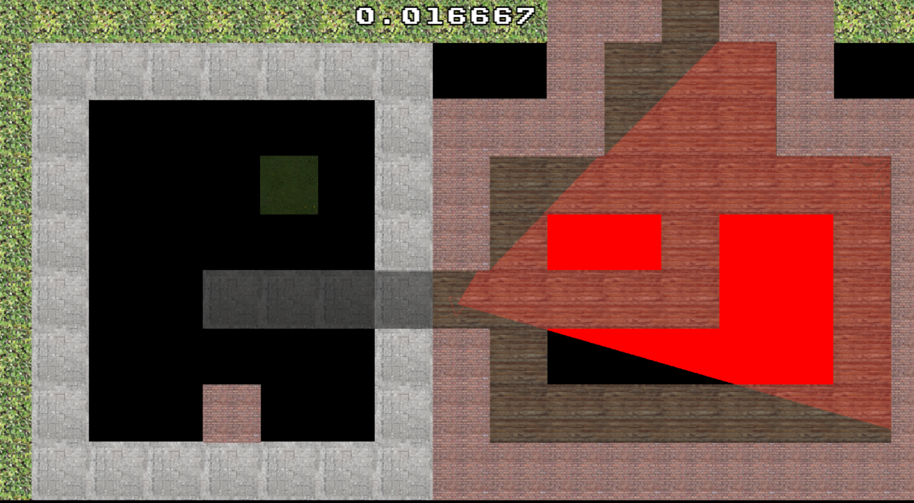

# About
'Spear' is a C++ OpenGL game engine built from scratch using the SDL2.0 framework. Developed for fun in my spare time. Very much a WIP.

# Current features:
•  **3D Raycaster** with vertical/horizontal mouselook\
•  **An explorable world** including multistory walls, cubes, fences, and bridges\
•  **Built-in level editor** (WIP)

# Setup
• Open solution using latest Visual Studio\
• Set solution platform to x64\
• Ensure SpearGame is set as the startup project\
• Run the program

# Controls
*Play Mode*\
• Spacebar: toggle between 2D Ray Visualisation and 3D Raycaster\
• WASD: player movement\
• Shift: sprint\
• Mouse: horizontal/verical camera movement\

*Edit Mode*\
• Ctrl+L: load existing map\
• Ctrl+S: overwrite existing map\
• Square Brackets: cycle active edit mode\
• Left Click: select/apply tiles\
• Right Click: delete/decrement tiles\
• Q/E: zoom out/in\
• -/+: decrease/increase map size

# Screenshots

